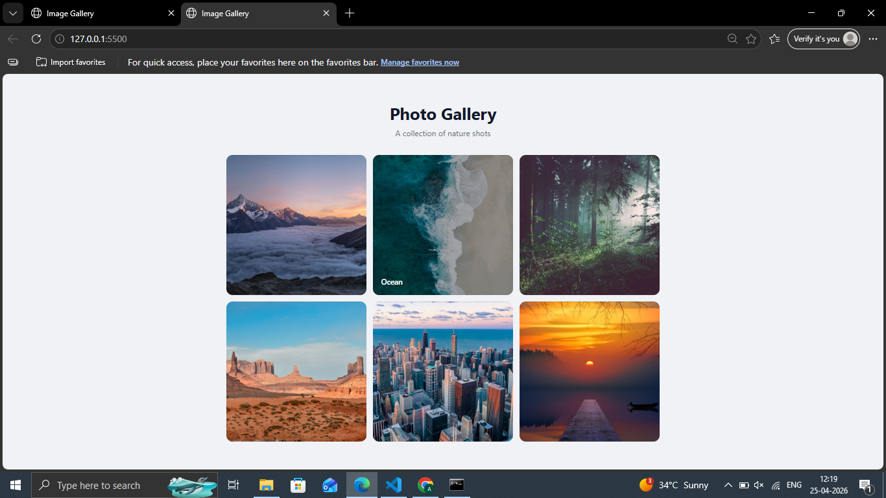

# Day 05 — Image Gallery

A responsive image gallery with hover overlay effects, built with pure HTML and CSS.

## Preview

## Features
- 6-card CSS Grid layout
- Smooth zoom on hover using transform scale
- Overlay with label fades in on hover
- Responsive — switches to 2 columns on mobile
- Easy to swap in real images

## Tech Stack
- HTML5
- CSS3 (Grid, transitions, transform, aspect-ratio)

## What I Learned
- CSS Grid for equal-size card layouts
- Using aspect-ratio to make perfect squares
- Layering overlays with position absolute + inset
- Chaining transitions for smooth hover effects

## Part of
[30 Days 30 Projects](https://github.com/anmisha-dash/30-days-30-projects) challenge
